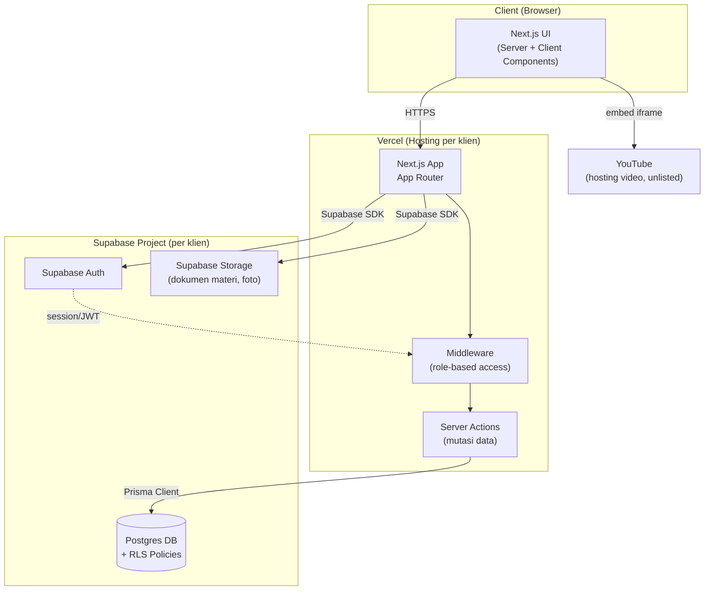
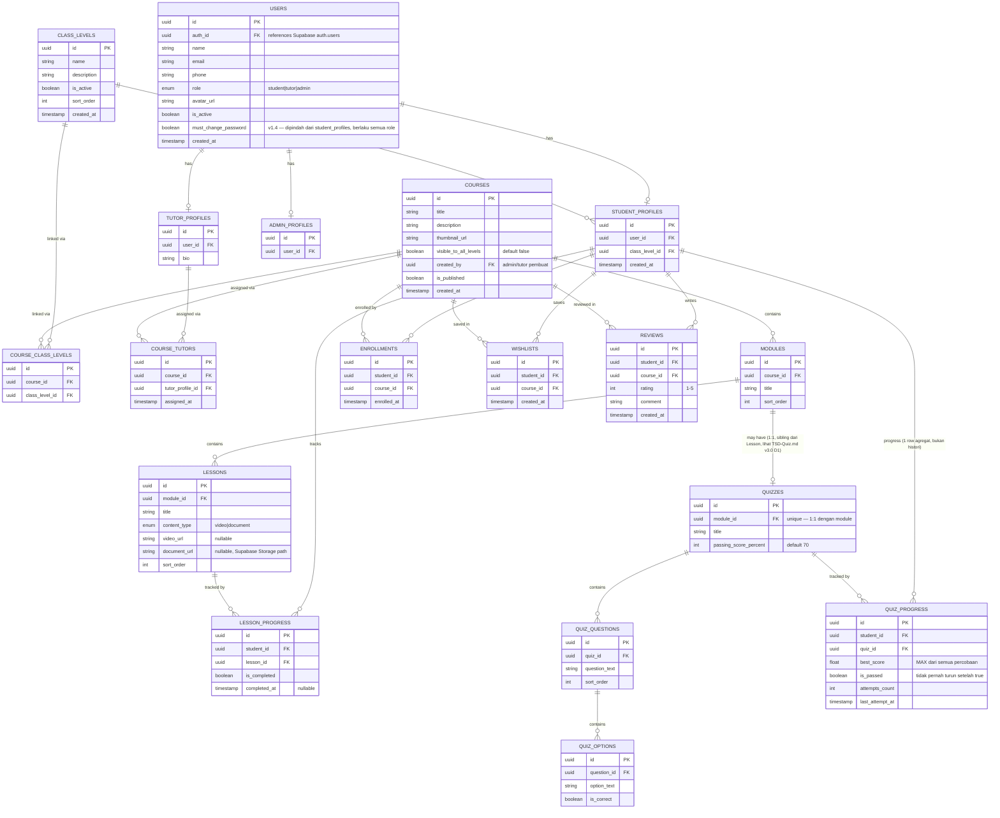
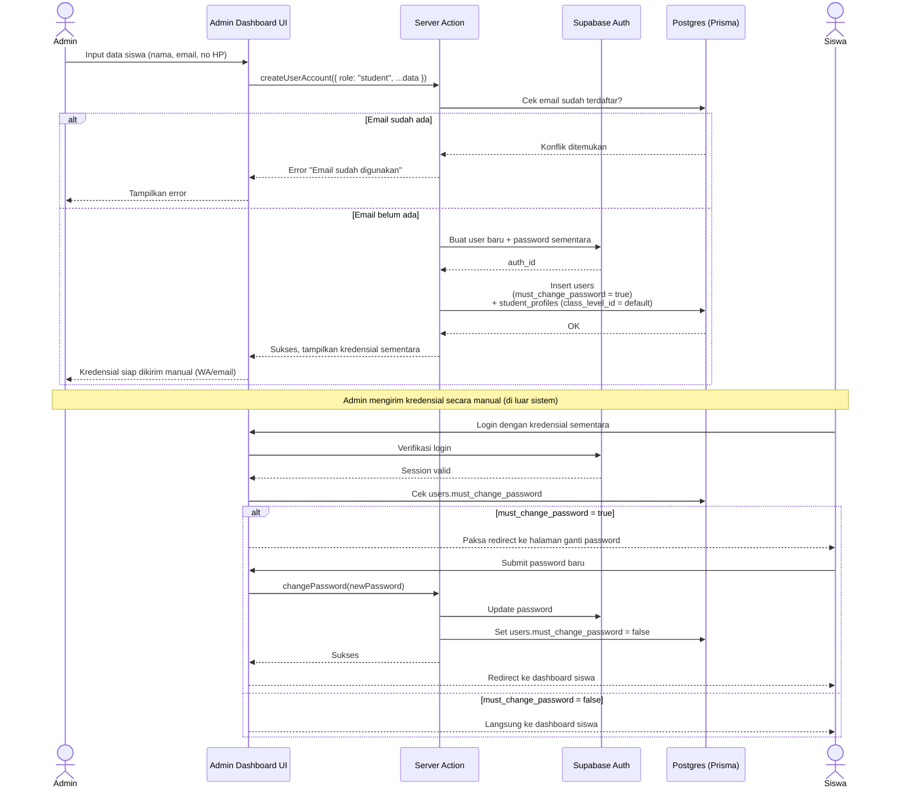
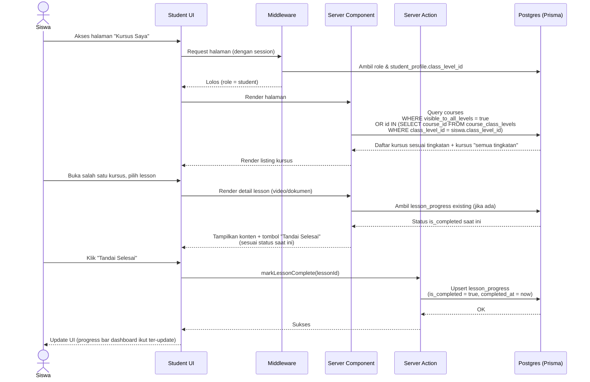
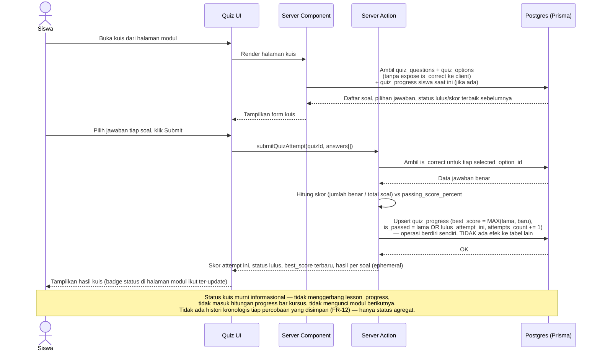

# Software Design Document (SDD)
## LMS Bimbel Template — [Nama Produk]

**Versi:** 1.5
**Tanggal:** 2 September 2026
**Terkait dokumen:** PRD.md (v2.4)
**Cakupan dokumen:** Fokus desain **Tier 1 (Base MVP)**. Tier 2 dibahas sebagai *extension notes* di tiap section relevan (bukan didesain detail) — akan didetailkan ulang sebagai revisi SDD terpisah saat Tier 2 mulai dikerjakan, sesuai fase di Implementation Plan.

> **Ringkasan perubahan v1.5:** Perombakan sisi tutor & course — pindah tingkatan siswa kembali murni hak admin (revert), Course Detail jadi 1 komponen shared admin/tutor dengan mode edit/preview + daftar siswa enrolled & reviews per-course. Detail lengkap: TSD-Course-Content.md v1.6, TSD-Auth-ClassLevel.md v1.2, TSD-Tutor-Dashboard.md v1.1.
>
> **Ringkasan perubahan v1.4:** `must_change_password` dipindah dari `student_profiles` ke `users` (berlaku semua role) — konsekuensi dari `createStudentAccount` yang digeneralisasi jadi `createUserAccount` (role: student/tutor/admin) di TSD-Auth-Account-Management.md v1.1. Detail lengkap & alasan: TSD-Auth-Account-Management.md v1.1 §3.1, TSD-Admin-Dashboard.md v1.1.
>
> **Ringkasan perubahan v1.3:** Relasi Quiz dipindah dari Lesson ke **Module** (1:1, sejajar dengan Lesson sebagai sub-materi, sesuai bahasa asli FR-7). Kelulusan kuis dipertegas **murni informasional** — tidak lagi mengisi `lesson_progress` secara otomatis seperti disebut di v1.2. Detail lengkap: TSD-Quiz.md v3.0.
>
> **Ringkasan perubahan v1.2:** Desain Quiz Module dirombak (§2 ERD, §4 Server Actions, §6.3 flow) — dari "riwayat percobaan penuh" (`quiz_attempts`/`quiz_answers`) menjadi post-test per lesson dengan `quiz_progress` (1 row agregat per siswa) & passing grade, kelulusan otomatis mengisi `lesson_progress`. Detail lengkap ada di TSD-Quiz.md v2.0. Desain lama dicatat sebagai kandidat fitur "exam standalone" terpisah di masa depan.
>
> **Ringkasan perubahan v1.1:** Relasi `courses` ↔ `class_levels` diubah dari single FK nullable menjadi **many-to-many** (`course_class_levels`) + flag eksplisit `visible_to_all_levels`. Kepemilikan kursus oleh tutor diubah dari asumsi implisit jadi **many-to-many eksplisit** (`course_tutors`), mendukung co-teaching dan jadi dasar pemisahan akses Admin (lintas institusi) vs Tutor (scoped ke kursus miliknya) — lihat Design Decisions §7.6, §7.7.

---

## 1. Overview & Context

### 1.1 Ringkasan Masalah
Institusi bimbel skala kecil-menengah mengelola operasional belajar-mengajar (materi, progress siswa, jadwal, pembayaran) secara manual lewat kombinasi WhatsApp dan Excel, atau bergantung pada plugin LMS generik (WordPress) yang mahal secara lisensi berulang dan sulit dikustomisasi. (Detail lengkap: PRD §1)

### 1.2 Ringkasan Solusi
Template LMS berbasis Next.js + Supabase yang **dijual sebagai project sekali bayar** ke tiap institusi bimbel, dengan **deployment & database terpisah penuh per klien** (bukan SaaS multi-tenant). Satu codebase master dikonfigurasi ulang (branding, feature flag tier) dan di-deploy sebagai instance baru untuk tiap klien.

Tier 1 (cakupan dokumen ini) mencakup: autentikasi role-based dengan akun siswa dibuat admin, manajemen kelas/tingkatan, manajemen kursus & materi (video YouTube unlisted + dokumen) dengan progress manual, kuis pilihan ganda, dashboard siswa & admin, landing page & blog.

### 1.3 Asumsi Desain
- **A1:** Setiap instance (per klien) melayani tepat satu institusi bimbel — tidak ada kebutuhan isolasi data antar-institusi dalam satu deployment (lihat Design Decision §7.1).
- **A2:** Volume pengguna per instance kecil-menengah (100–200 concurrent users, sesuai NFR PRD §6) — desain tidak dioptimasi untuk skala ribuan pengguna simultan.
- **A3:** Admin institusi punya kemampuan teknis dasar (bisa mengoperasikan dashboard web), tapi bukan technical user — UI harus straightforward tanpa asumsi pengetahuan teknis.
- **A4:** Koneksi internet siswa bervariasi (banyak dari smartphone dengan koneksi seluler) — desain harus toleran terhadap koneksi tidak stabil (relevan untuk FR-9 penandaan manual, lebih ringan dibanding tracking video real-time).
- **A5:** Video YouTube unlisted diasumsikan dikelola sendiri oleh institusi/tutor (upload ke akun YouTube mereka) — sistem hanya menyimpan URL, tidak melakukan hosting/transcoding video.

### 1.4 Constraint Desain
- **C1 (Biaya operasional):** Arsitektur harus tetap berjalan di free/hobby tier Vercel + Supabase untuk instance skala kecil (selaras dengan model bisnis "beli putus", klien tidak mau menanggung biaya infrastruktur besar berkelanjutan).
- **C2 (Replicability):** Tidak boleh ada nilai spesifik-klien (nama institusi, warna, dsb) yang hardcoded di kode — harus melalui config, karena arsitektur ini yang memungkinkan model "1 codebase, banyak klien" (PRD §1.4).
- **C3 (Tim kecil):** Didesain untuk dikerjakan & di-maintain oleh 1 developer (atau tim sangat kecil) — kompleksitas arsitektur (microservices, event queue, dsb) sengaja dihindari kecuali benar-benar diperlukan.
- **C4 (Stack tetap):** Next.js (App Router, TypeScript), Supabase (Postgres, Auth, Storage), Prisma ORM, Tailwind + shadcn/ui — sudah diputuskan di tahap sebelumnya, tidak dibuka ulang di dokumen ini.

---

## 2. System Architecture

### 2.1 Gambaran Umum
Arsitektur monolitik modular dalam satu aplikasi Next.js (App Router), berjalan sebagai kombinasi **Server Components** (rendering & fetch data di server) dan **Server Actions** (mutasi data tanpa API layer terpisah), dengan Supabase sebagai backend-as-a-service untuk autentikasi, database, dan storage.

Tidak ada backend service terpisah (tidak ada Express/NestJS/dsb) — Next.js App Router berperan sebagai full-stack layer, berkomunikasi langsung ke Supabase lewat Prisma (untuk query terstruktur) dan Supabase client SDK (untuk auth & storage). Ini konsisten dengan Constraint C3 (tim kecil) — mengurangi jumlah moving parts yang perlu di-maintain & di-deploy.

### 2.2 Diagram Arsitektur (Level Tinggi)

### 2.3 Komponen Utama & Hubungannya

| Komponen | Peran | Berkomunikasi dengan |
|---|---|---|
| **Next.js App (App Router)** | Rendering UI (SSR/CSR), routing, orchestration | Middleware, Server Actions, Supabase SDK |
| **Middleware** | Proteksi route berbasis role, validasi session | Supabase Auth (baca session/JWT) |
| **Server Actions** | Semua mutasi data (create/update/delete) dipanggil langsung dari komponen UI tanpa REST API terpisah | Prisma Client → Postgres |
| **Prisma Client** | Query & mutasi terstruktur & type-safe ke database | Supabase Postgres |
| **Supabase Auth** | Manajemen user, session, JWT | Digunakan Middleware & Server Actions untuk otorisasi |
| **Supabase Postgres + RLS** | Penyimpanan data utama, dengan Row Level Security sebagai lapisan proteksi tambahan di level database | Diakses via Prisma (query terstruktur) dan langsung via Supabase SDK untuk kasus tertentu (misal realtime jika dibutuhkan nanti) |
| **Supabase Storage** | Penyimpanan file (dokumen materi PDF/PPT, foto profil, logo institusi) | Diakses via Supabase SDK dari Server Actions/Components |
| **YouTube (eksternal)** | Hosting & streaming video materi (unlisted) | Sistem hanya menyimpan URL, embed via iframe di client |

### 2.4 Kenapa Bukan Arsitektur Terpisah (API Backend Sendiri)

Dipertimbangkan alternatif membangun backend terpisah (misal Express/NestJS + Next.js sebagai frontend murni), tapi ditolak karena:
- Menambah kompleksitas deploy (2 service terpisah per klien, bukan 1) — bertentangan dengan Constraint C1 & C3
- Next.js Server Actions + Supabase sudah cukup menangani seluruh kebutuhan Tier 1 tanpa perlu API layer terpisah
- Untuk skala per-klien yang kecil (NFR: 100–200 concurrent users), monolitik modular ini tidak menjadi bottleneck performa

Lihat Design Decisions §7 untuk detail trade-off lain.

---

## 3. Data Model

### 3.1 Keputusan Model User & Role

Sesuai keputusan: **satu tabel `users` dengan kolom `role`**, ditautkan ke tabel profil spesifik per role (`student_profiles`, `tutor_profiles`, `admin_profiles`). Alasan:
- Supabase Auth secara native mengelola satu tabel identitas (`auth.users`) — pendekatan 1 tabel `users` aplikasi yang mengacu ke `auth.users` (via `auth_id`) lebih alami mengikuti pola ini, dibanding mencoba memetakan `auth.users` ke 3 tabel role terpisah sekaligus.
- Middleware & RLS policy jadi lebih sederhana: cukup baca satu kolom `role` untuk keputusan otorisasi, tidak perlu mengecek keberadaan row di 3 tabel berbeda untuk tahu "user ini role apa".
- Data yang **umum** di semua role (nama, email, foto profil, status aktif) disimpan di `users`; data yang **spesifik** per role (misal `class_level_id` hanya relevan untuk siswa) dipisah ke tabel profil masing-masing — menghindari tabel `users` punya banyak kolom nullable yang membingungkan.

### 3.2 Entity Relationship Diagram (Tier 1)

### 3.3 Keputusan Database Lain

- **Tanpa `tenant_id`:** Sesuai keputusan single-tenant per instance (PRD §1.4), tidak ada kolom `tenant_id`/`institution_id` di manapun. Ini menyederhanakan seluruh skema & query secara signifikan dibanding desain multi-tenant.
- **Soft-delete untuk `class_levels`:** Kolom `is_active` (bukan hard delete) untuk mendukung edge case FR-36 — tingkatan yang masih punya siswa aktif tidak boleh dihapus permanen.
- **`COURSE_CLASS_LEVELS` (pivot) + flag `visible_to_all_levels`:** Merepresentasikan aturan bisnis FR-38 — satu kursus bisa terkait ke satu, beberapa, atau (via flag eksplisit) semua tingkatan. Flag dipilih eksplisit (bukan "relasi kosong = semua tingkatan") supaya admin tidak bisa secara tidak sengaja membuat kursus terbuka ke semua siswa hanya karena lupa mengisi relasi tingkatan — kondisi ini divalidasi saat publish (lihat FR-38 edge case).
- **`COURSE_TUTORS` (pivot):** Satu kursus dapat diampu lebih dari satu tutor (co-teaching), dan satu tutor dapat mengampu banyak kursus — many-to-many murni. Tabel ini juga jadi dasar scoping akses tutor (FR-41): query "kursus milik tutor ini" dan "siswa yang relevan dengan tutor ini" selalu melalui tabel ini, bukan asumsi implisit dari `created_by`.
- **`LESSON_PROGRESS` sebagai tabel tunggal untuk Tier 1 & Tier 2:** Struktur tabel ini sengaja dirancang cukup generik (`is_completed`, `completed_at`) agar kompatibel dipakai baik oleh alur manual (Tier 1, diisi lewat klik tombol) maupun alur otomatis (Tier 2/FR-39, diisi lewat kalkulasi durasi tonton) — menghindari migrasi skema saat upgrade tier (lihat Design Decisions §7.4).
- **`must_change_password` di `users` (v1.4, dipindah dari `student_profiles`):** Awalnya cuma untuk siswa (FR-2), tapi karena semua akun (siswa/tutor/admin tambahan) sekarang dibuat lewat jalur `createUserAccount` yang sama (TSD-Auth-Account-Management.md v1.1), dan sistem belum ada verifikasi email (jadi admin-triggered reset jadi jalur cadangan utama untuk semua role), flag ini dipindah ke `users` supaya berlaku seragam.

### 3.4 Extension Notes — Tier 2
Tabel tambahan yang **akan** diperlukan saat Tier 2 dikerjakan (tidak dibuat sekarang): `parent_profiles` + tabel pivot `parent_student_links` (many-to-many, satu orang tua bisa punya banyak anak), `orders`, `payments`, `live_classes`, `attendances`, `certificates`, `qna_threads`, `qna_replies`. Tidak didesain detail di dokumen ini karena berpotensi berubah signifikan tergantung pilihan payment gateway final & kebutuhan riil klien pertama.

---

## 4. API Design

### 4.1 Pola Komunikasi

**Server Actions sebagai pola utama** (bukan REST API terpisah) untuk seluruh mutasi data yang dipicu dari UI dalam aplikasi yang sama (create course, mark lesson complete, submit quiz, dsb). Next.js Server Actions dipanggil langsung dari Client/Server Component, mengeksekusi kode di server tanpa perlu mendefinisikan endpoint REST + fetch call terpisah.

**Route Handler (REST-like) hanya dipakai untuk kasus yang butuh HTTP endpoint eksplisit** — di Tier 1, ini terbatas pada kebutuhan seperti webhook (belum relevan sampai Tier 2/payment) atau endpoint yang dipanggil dari luar aplikasi Next.js itu sendiri. Tier 1 murni tidak banyak butuh Route Handler karena semua interaksi terjadi dalam satu aplikasi.

### 4.2 Daftar "Endpoint" Level Tinggi (Server Actions, dikelompokkan per domain)

> Catatan: karena berbasis Server Actions, ini bukan daftar URL endpoint REST, melainkan daftar *fungsi aksi* yang dipanggil dari UI. Detail parameter & return type didetailkan di TSD per fitur.

**Auth & User Management**
- `loginUser` — autentikasi via Supabase Auth
- `createStudentAccount` — admin membuat akun siswa (FR-2)
- `changePassword` — ganti password (termasuk alur wajib ganti saat login pertama)
- `updateProfile` — update data profil dasar
- `resetPasswordRequest` — proses reset password

**Class Level Management**
- `createClassLevel`, `updateClassLevel`, `deactivateClassLevel` (soft-delete, FR-36)
- `assignStudentToClassLevel` — pindahkan siswa antar tingkatan (FR-37)

**Course & Content Management**
- `createCourse`, `updateCourse`, `publishCourse`, `deleteCourse` (FR-7; validasi publish memerlukan minimal 1 tingkatan terkait atau flag `visible_to_all_levels`, FR-38)
- `assignClassLevelsToCourse` — set relasi many-to-many `course_class_levels` + flag (FR-38)
- `assignTutorToCourse`, `unassignTutorFromCourse` — kelola `course_tutors`, hanya bisa dipanggil admin (FR-40)
- `createModule`, `updateModule`, `reorderModules`
- `createLesson`, `updateLesson`, `reorderLessons` (FR-8, FR-10)
- `uploadDocument` — upload ke Supabase Storage, kembalikan path (FR-10)

**Enrollment & Progress**
- `getEnrolledCourses` (query, bukan mutasi — via Server Component fetch langsung)
- `markLessonComplete` / `unmarkLessonComplete` (FR-9)

**Quiz (post-test per modul, lihat TSD-Quiz.md v3.0)**
- `createQuiz`, `addQuizQuestion`, `addQuizOption` (FR-11) — 1 modul maksimal 1 kuis
- `submitQuizAttempt` — terima jawaban, hitung skor otomatis, upsert `quiz_progress` (skor terbaik & status lulus) — murni badge, tidak menyentuh tabel lain (FR-11, FR-12)
- `getQuizProgressSummaryForStudent` (query) — status agregat, bukan histori kronologis tiap percobaan

**Wishlist & Reviews**
- `addToWishlist`, `removeFromWishlist` (FR-15)
- `submitReview` (FR-16)

**Admin Dashboard**
- `getAdminDashboardSummary` (query: total siswa, kursus, kelas berjalan — FR-29, scope seluruh institusi)
- `getStudentList`, `getTutorList` (query + filter, scope seluruh institusi)

**Tutor Dashboard**
- `getTutorStudents` (query, discoped otomatis lewat `course_tutors` — FR-41, tidak menerima parameter "lihat semua", hanya siswa milik tutor yang login). Untuk manajemen kursus (`getCourses`), daftar kursus Tutor dipangkas murni ke kursus yang diampunya saja (`course_tutors`). Untuk melihat/mereview kursus lain, tersedia query khusus `getAllCoursesForPreview`. Pembedaan hak edit menggunakan `created_by` (Tutor Utama / Owner vs Co-Tutor).

**Landing Page & Blog**
- Konten landing page & blog di Tier 1 bersifat mostly-static/config-driven & MDX — tidak semuanya butuh Server Action, sebagian besar cukup Server Component fetch langsung dari config/file MDX.

### 4.3 Extension Notes — Tier 2
Saat Tier 2 masuk, beberapa Route Handler (bukan Server Action) akan dibutuhkan karena harus diakses dari luar aplikasi:
- `POST /api/webhook/payment` — menerima callback dari Midtrans/Xendit (FR-24)
- `POST /api/webhook/whatsapp` *(jika diperlukan, tergantung provider Fonnte/Wablas)* — untuk status delivery notifikasi (FR-22, FR-25)

Pola Server Actions untuk domain lain (live class, Q&A, sertifikat) kemungkinan tetap dipertahankan konsisten dengan pola Tier 1.

---

## 5. Component Breakdown

| Modul | Tanggung Jawab | Dependensi Utama |
|---|---|---|
| **Auth Module** | Login, logout, session management, alur admin-created account, ganti password wajib, reset password | Supabase Auth, Middleware |
| **Access Control Middleware** | Membaca role dari session, membatasi akses route sesuai role (siswa/tutor/admin), redirect ke halaman Unauthorized jika akses tidak sah. Untuk tutor, membatasi *aksi tulis* (edit/publish/kelola siswa) ke kursus yang dia ampu (lihat FR-41) — tapi tutor tetap boleh **membaca** semua kursus institusi lewat tab "Kursus Lain" (read-only preview, TSD-Course-Content.md v1.6) | Supabase Auth session, Course & Tutor Assignment Module |
| **Course & Content Module** | CRUD kursus/modul/lesson, filter tampilan kursus sesuai tingkatan siswa, embed video YouTube, upload & preview dokumen. Course Detail 1 komponen shared untuk admin & tutor — mode edit divalidasi terhadap keanggotaan di `course_tutors`, mode read-only untuk tutor lain (v1.6). Termasuk daftar siswa enrolled per-course (khusus akses edit) & reviews (untuk semua) | Prisma, Supabase Storage, Class Level Module, Tutor Assignment Module, Student Dashboard Module (reuse `getReviewsForCourse`) |
| **Class Level Module** | CRUD kategori tingkatan, penetapan tingkatan default saat akun dibuat, perpindahan siswa antar tingkatan (**murni hak admin**, tidak didelegasikan ke tutor — TSD-Auth-ClassLevel.md v1.2), helper query filter akses kursus berbasis tingkatan (many-to-many + flag `visible_to_all_levels`, dipakai ulang oleh Course Module) | Prisma, Course Module (konsumen helper) |
| **Tutor Assignment Module** | Assign/unassign tutor ke kursus (many-to-many via `course_tutors`), jadi sumber kebenaran tunggal untuk scoping akses tutor (dipakai Middleware & Course Module) — hanya bisa dioperasikan oleh admin (FR-40) | Prisma |
| **Progress Tracking Module** | Simpan/hapus status "selesai" per lesson per siswa (manual, Tier 1) | Prisma |
| **Quiz Module** | Builder kuis per modul (tutor/admin), pengerjaan kuis (siswa), penilaian otomatis vs passing grade — murni badge informasional, tidak menggerbang modul lain | Prisma |
| **Student Dashboard Module** | Agregasi data ringkasan (enrolled/aktif/selesai), wishlist, reviews — komposisi dari Course, Progress, dan modul terkait lainnya | Course Module, Progress Module |
| **Admin Dashboard Module** | Ringkasan operasional (total siswa/kursus/kelas), akses ke CRUD user & kursus | Semua modul CRUD di atas |
| **Branding Config Module** | Sumber tunggal konfigurasi tampilan/identitas institusi (`config/institution.ts`), dikonsumsi oleh Landing Page & seluruh layout | — (static config, bukan database) |
| **Landing Page & Blog Module** | Halaman publik: hero, statistik, listing kursus publik, testimoni, artikel blog (MDX) dengan SEO metadata | Branding Config Module, Course Module (untuk listing publik) |

### 5.1 Prinsip Pemisahan Modul
Setiap modul di atas dipetakan langsung ke folder terpisah di struktur project (lihat Implementation Plan §5) — tujuannya supaya modul Tier 2 (payment, live class, dst) bisa ditambahkan sebagai folder/modul baru tanpa perlu menyentuh isi modul Tier 1 yang sudah ada, selaras dengan prinsip "modular per fitur" yang sudah ditetapkan di Implementation Plan §2.

---

## 6. Key Flow / Sequence Diagram

### 6.1 Flow: Admin Membuat Akun Siswa & Login Pertama Kali

> **Direvisi (2 September 2026, v1.4):** `createStudentAccount` sekarang generalisasi `createUserAccount` (role: student/tutor/admin) dan `must_change_password` pindah dari `student_profiles` ke `users` (berlaku semua role) — lihat TSD-Auth-Account-Management.md v1.1. Diagram di bawah tetap memakai contoh siswa (skenario paling sering) tapi flow-nya identik untuk role lain.

### 6.2 Flow: Akses Kursus Sesuai Tingkatan & Tandai Materi Selesai

### 6.3 Flow: Siswa Mengerjakan Kuis Modul (Post-Test, Badge Informasional)

> **Direvisi (2 September 2026):** Kuis sekarang melekat ke **Module** (bukan Lesson), sejajar dengan Lesson sebagai sub-materi. Model post-test dengan passing grade tetap dipakai — tidak ada tabel `quiz_attempts`/`quiz_answers` granular, cukup 1 row agregat `quiz_progress` per siswa per kuis. **Kelulusan murni informasional** — tidak lagi mengisi `lesson_progress` (beda dari revisi sebelumnya di v1.2/TSD-Quiz.md v2.0). Detail lengkap & alasan tiap keputusan: **TSD-Quiz.md v3.0**. Alur "riwayat percobaan penuh + structure-locked" versi paling awal dipindah jadi draft fitur terpisah (exam standalone), lihat Implementation-Plan.md §4 Fase 11.

---

## 7. Design Decisions & Trade-offs

### 7.1 Single-tenant per instance (bukan multi-tenant)
**Keputusan:** Setiap klien mendapat deployment & database Supabase terpisah sepenuhnya, tanpa kolom `tenant_id`.

**Alasan:** Selaras dengan model bisnis "jual project, kepemilikan pindah ke klien" (PRD §1.4) — klien memiliki instance mereka sendiri sepenuhnya, bukan berbagi infrastruktur dengan klien lain. Juga menyederhanakan skema & RLS policy secara signifikan (tidak perlu filter tenant di setiap query).

**Alternatif yang dipertimbangkan:** Shared database dengan `tenant_id` + RLS (pola SaaS umum). Ditolak karena kontradiktif dengan model bisnis (klien tidak benar-benar "memiliki" instance mereka jika berbagi database dengan klien lain), dan menambah kompleksitas RLS yang tidak diperlukan untuk skala per-klien yang kecil.

**Trade-off yang diterima:** Effort deploy per klien baru menjadi manual (bukan otomatis lewat 1 dashboard admin lintas klien) — diterima karena volume klien di awal masih kecil, dan proses ini sudah direncanakan didokumentasikan sebagai langkah replikasi terstandar (Implementation Plan Fase 7).

### 7.2 Server Actions (bukan REST API terpisah) sebagai pola komunikasi utama
**Keputusan:** Next.js Server Actions dipakai untuk seluruh mutasi data, bukan endpoint REST + fetch layer terpisah.

**Alasan:** Mengurangi boilerplate (tidak perlu definisi endpoint + client fetch wrapper terpisah), type-safety end-to-end lebih mudah dijaga (function signature langsung, tanpa perlu sinkronisasi manual dengan schema request/response API), dan cocok untuk arsitektur monolitik dalam satu aplikasi (Constraint C3).

**Alternatif yang dipertimbangkan:** REST API terpisah (misal via Route Handlers penuh). Ditolak untuk Tier 1 karena menambah lapisan abstraksi yang tidak diperlukan ketika seluruh consumer API adalah aplikasi itu sendiri. Route Handler tetap dipakai secara selektif nanti untuk kebutuhan yang benar-benar butuh HTTP endpoint eksternal (webhook Tier 2).

**Trade-off yang diterima:** Jika suatu saat dibutuhkan API publik untuk integrasi eksternal (misal API akses yang disebut PRD §7.3 sebagai Out of Scope), akan perlu effort tambahan membungkus sebagian Server Actions jadi Route Handler — diterima karena kebutuhan itu eksplisit di luar scope Tier 1 & Tier 2.

### 7.3 Model user: 1 tabel `users` + role, dengan tabel profil terpisah
**Keputusan:** Lihat detail di §3.1.

**Alternatif yang dipertimbangkan:** Tabel terpisah penuh per role sejak awal (`students`, `tutors`, `admins` tanpa tabel `users` bersama). Ditolak karena akan menyulitkan query lintas role (misal admin melihat daftar "semua user" gabungan), dan tidak selaras dengan model auth Supabase yang berbasis satu tabel identitas (`auth.users`).

**Trade-off yang diterima:** Query yang butuh data gabungan (user + profil spesifik role) perlu join tambahan — diterima karena Prisma menangani ini dengan relasi yang cukup ringkas (`include`), dan volume data per instance kecil sehingga dampak performa dari join tambahan ini diabaikan.

### 7.4 `lesson_progress` dirancang generik untuk mendukung Tier 1 (manual) maupun Tier 2 (otomatis)
**Keputusan:** Lihat detail di §3.3.

**Alasan:** Menghindari migrasi skema (dan potensi migrasi data) saat klien upgrade dari Tier 1 ke Tier 2 — cara pengisian kolom berubah (klik manual vs kalkulasi otomatis dari video), tapi struktur tabel tetap sama.

**Alternatif yang dipertimbangkan:** Tabel terpisah `manual_progress` dan `video_progress`. Ditolak karena menambah kompleksitas query dashboard (harus union dua tabel) tanpa manfaat signifikan, mengingat kedua pendekatan secara konseptual merepresentasikan hal yang sama (status penyelesaian materi).

### 7.5 Class Level dibangun di Tier 1, bukan ditunda
Sudah dibahas detail alasannya di PRD §5.1a dan Implementation Plan §2 — dicatat ulang di sini karena ini salah satu keputusan arsitektur data model paling berpengaruh di dokumen ini (mempengaruhi desain `courses`, `student_profiles`, dan seluruh query listing kursus di §3–4).

### 7.6 Course-Class Level: many-to-many + flag eksplisit (bukan single FK nullable)
**Keputusan:** `courses` ↔ `class_levels` direlasikan lewat tabel pivot `course_class_levels`, ditambah kolom `visible_to_all_levels` (boolean) di `courses` untuk kasus "berlaku semua tingkatan".

**Alasan:** Kebutuhan riil bimbel tidak selalu 1 kursus = 1 tingkatan atau 0 tingkatan (semua) — banyak kasus 1 kursus relevan untuk beberapa tingkatan sekaligus (misal materi pengayaan lintas kelas). Desain awal (single `class_level_id` nullable) terlalu kaku untuk kasus ini.

**Alternatif yang dipertimbangkan:** Pakai relasi kosong (`course_class_levels` tanpa baris) sebagai penanda implisit "berlaku semua tingkatan", tanpa flag terpisah. Ditolak karena rawan human error — admin yang lupa mengisi relasi tingkatan sama sekali (bukan karena sengaja mau "semua tingkatan") akan membuat kursus tanpa sadar terbuka untuk semua siswa. Flag eksplisit memaksa keputusan itu jadi sadar, dan divalidasi saat publish (FR-38 edge case).

**Trade-off yang diterima:** Query filter kursus jadi sedikit lebih kompleks (join ke pivot table + cek flag, dibanding sekadar `WHERE class_level_id = X OR class_level_id IS NULL`) — diterima karena kompleksitas ini terpusat di satu helper query (Class Level Module, §5), tidak berulang di banyak tempat, dan risiko human error yang dicegah lebih berharga dibanding kompleksitas query tambahan yang kecil.

### 7.7 Kepemilikan kursus oleh tutor: many-to-many (bukan single owner)
**Keputusan:** Tabel pivot `course_tutors` menghubungkan `courses` ↔ `tutor_profiles` secara many-to-many — satu kursus bisa diampu beberapa tutor (co-teaching), satu tutor bisa mengampu banyak kursus.

**Alasan:** Merepresentasikan pola riil bimbel di mana satu kelas/kursus kadang diampu bergantian atau bersama oleh lebih dari satu tutor (misal tutor utama + asisten, atau rotasi tutor per semester). Tabel ini juga menjadi dasar tunggal untuk menegakkan **pemisahan akses admin vs tutor** (lihat PRD §3 persona Admin vs Tutor) — tutor hanya melihat kursus & siswa yang terhubung dengannya lewat tabel ini, sementara admin tidak dibatasi tabel ini sama sekali (selalu melihat semua).

**Alternatif yang dipertimbangkan:** Kolom `owner_tutor_id` tunggal (nullable) langsung di `courses`. Lebih sederhana secara query, tapi tidak mampu merepresentasikan co-teaching — harus dipilih ulang jika kebutuhan itu muncul nanti, berarti migrasi skema. Karena kebutuhan multi-tutor sudah diketahui dari awal (bukan spekulasi), pivot table dipilih langsung untuk menghindari migrasi di kemudian hari.

**Trade-off yang diterima:** Scoping akses tutor (§8 NFR Security) butuh subquery/join ke `course_tutors` di setiap tempat yang mengizinkan tutor mengubah data atau melihat progress siswa — diterima dengan pola yang sama seperti §7.6, dipusatkan di satu helper/RLS policy, bukan ditulis ulang manual di tiap halaman.

---

## 8. Non-Functional Considerations

| NFR (dari PRD §6) | Bagaimana Desain Ini Menjawabnya |
|---|---|
| **Performance** (Lighthouse ≥90, response <500ms p95) | Server Components untuk halaman yang didominasi baca data (listing kursus, landing page) mengurangi JS yang dikirim ke client. `next/image` untuk optimasi gambar (thumbnail kursus, logo). Server Actions menjalankan query langsung di server tanpa round-trip API tambahan. |
| **Scalability** (100–200 concurrent users per instance) | Arsitektur monolitik modular ini cukup untuk skala tersebut — Vercel & Supabase menangani scaling infrastruktur dasar (serverless functions, connection pooling Postgres) tanpa perlu desain khusus tambahan di level aplikasi. |
| **Availability** (99% uptime) | Ditentukan oleh SLA Vercel + Supabase, bukan oleh desain aplikasi — desain aplikasi tidak menambah single point of failure tambahan (tidak ada service kustom terpisah yang perlu di-maintain uptime-nya sendiri). |
| **Security — RLS aktif per role** | Setiap tabel yang berisi data personal (terutama `student_profiles`, `lesson_progress`, `quiz_progress`) akan punya RLS policy yang membatasi akses berdasarkan `auth.uid()` yang cocok dengan `user_id` terkait, dan role (siswa hanya baca data miliknya, admin baca semua). **Tutor dibatasi lebih spesifik**: policy untuk tutor memfilter lewat `course_tutors` — hanya kursus yang dia ampu dan siswa yang terenroll di kursus itu, bukan seluruh data institusi (lihat Design Decision §7.7). Detail policy per tabel didetailkan di TSD. |
| **Security — kredensial tidak hardcoded** | Seluruh API key (Supabase, dan nanti payment/WA gateway di Tier 2) wajib lewat environment variable, didokumentasikan di `.env.example` (selaras dengan Implementation Plan Fase 1). |
| **Usability — mobile-first** | Tailwind + shadcn/ui dipakai dengan pendekatan mobile-first breakpoint dari awal desain komponen, bukan didesain desktop-first lalu di-adapt. |
| **Data Integrity — status selesai tersimpan segera** | `markLessonComplete` (Server Action) langsung melakukan write ke database saat diklik — tidak ada state client-only yang berisiko hilang sebelum tersimpan, konsisten dengan pendekatan manual Tier 1 yang lebih sederhana dibanding auto-save berkala (yang baru relevan di Tier 2/FR-39). |
| **Portability/Replicability** | Dijawab langsung oleh Branding Config Module (§5) dan prinsip Constraint C2 — seluruh nilai spesifik-klien lewat `config/institution.ts` & `.env`, bukan hardcoded di komponen manapun. |
| **Maintainability** | Pemisahan modul per domain (§5) memetakan langsung ke struktur folder, memudahkan siapa pun (termasuk kamu sendiri setelah waktu berlalu) menelusuri kode per fitur tanpa harus memahami seluruh sistem sekaligus. |
| **Compliance — minimal data collection** | Skema data model (§3.2) sengaja tidak menyertakan field yang tidak dibutuhkan fungsional (misal tidak ada NIK, alamat detail, dsb kecuali eksplisit dibutuhkan nanti) — field baru harus melalui pertimbangan "apakah ini benar-benar dipakai fitur yang ada" sebelum ditambah. |

---

## 9. Dependencies & Integrations

| Layanan/Library | Fungsi | Tier | Catatan |
|---|---|---|---|
| **Supabase** (Auth, Postgres, Storage) | Backend-as-a-service utama | T1 | Satu project per klien |
| **Vercel** | Hosting & deployment aplikasi Next.js | T1 | Satu project per klien |
| **YouTube** | Hosting & streaming video materi (unlisted) | T1 | Sistem hanya simpan URL, tidak ada integrasi API resmi di Tier 1 (embed iframe biasa) — API YouTube IFrame baru dipakai di Tier 2 untuk FR-39 |
| **Prisma** | ORM, migrasi skema database | T1 | Dev dependency + runtime client |
| **react-hook-form + zod** | Validasi form sisi client & server | T1 | Konsisten dipakai di seluruh form (login, CRUD kursus, dsb) |
| **shadcn/ui + Tailwind CSS** | Komponen UI & styling | T1 | Termasuk komponen yang dipakai lintas modul (Table, Card, Dialog, dsb) |
| **Midtrans / Xendit** | Payment gateway | T2 | Belum diintegrasikan di Tier 1 |
| **Fonnte / Wablas** | WhatsApp gateway untuk notifikasi | T2 | Belum diintegrasikan di Tier 1 |
| **@react-pdf/renderer** | Generate sertifikat PDF | T2 | Belum diintegrasikan di Tier 1 |
| **react-youtube** | Wrapper YouTube IFrame API untuk tracking progress otomatis | T2 | Tier 1 cukup embed iframe biasa tanpa tracking |

---

## 10. Risks & Mitigations

| Risiko Teknis | Dampak | Mitigasi |
|---|---|---|
| **Scoping akses tutor lupa diterapkan di salah satu tempat** (misal satu halaman baru menampilkan data tutor tanpa filter `course_tutors`) — tutor bisa melihat data institusi di luar kursusnya | Sedang — pelanggaran batas akses antar tutor, berpotensi juga jadi kebocoran data siswa lintas tutor | Sama seperti mitigasi filter tingkatan (§10 baris kedua) — pusatkan logic scoping di Tutor Assignment Module & RLS policy (§7.7, §8), jangan ditulis manual berulang di tiap halaman/dashboard tutor |
| **RLS policy salah konfigurasi** — celah keamanan data antar role (misal siswa bisa baca data siswa lain) | Tinggi — kebocoran data personal | Setiap tabel dengan data personal wajib punya RLS policy yang ditulis & ditest eksplisit sebelum dianggap selesai (bukan asumsi "pasti aman"); checklist keamanan di Implementation Plan Fase 7 mencakup verifikasi ini |
| **Query filter tingkatan (`class_level_id = X OR class_level_id IS NULL`) lupa diterapkan di salah satu tempat** — siswa bisa mengakses kursus di luar tingkatannya | Sedang — pelanggaran aturan bisnis, bukan kebocoran data sensitif | Buat helper/query function terpusat di Class Level Module (§5) yang dipakai ulang di semua tempat yang menampilkan listing kursus, bukan menulis filter manual berulang di tiap halaman — mengurangi risiko ada satu tempat yang ketinggalan |
| **Video YouTube unlisted dihapus/di-private-kan oleh tutor tanpa sepengetahuan sistem** — materi jadi tidak bisa diakses siswa | Sedang — pengalaman belajar terganggu, tapi bukan risiko keamanan data | Di luar kendali teknis penuh sistem (video dikelola eksternal oleh tutor/institusi) — mitigasi paling realistis adalah dokumentasi/panduan penggunaan untuk tutor, bukan solusi teknis di level sistem |
| **Migrasi Tier 1 → Tier 2 pada klien yang sudah live** (terutama transisi `lesson_progress` manual → otomatis) menyebabkan data tidak konsisten | Sedang | Dijawab langsung oleh Design Decision §7.4 — struktur tabel generik sejak awal meminimalkan kebutuhan migrasi data, tapi tetap perlu rencana transisi eksplisit (misal: progress manual yang sudah ada dipertahankan sebagai "selesai" meski client pindah ke tracking otomatis, tidak di-reset) |
| **Ketergantungan pada free tier Supabase/Vercel** — instance klien bisa kena limit (misal cold start, batas storage) saat traffic naik | Rendah–Sedang, tergantung klien | Sudah dicatat sebagai risiko bisnis di Implementation Plan §6 — dari sisi desain teknis, arsitektur tidak menambah dependency lain yang memperparah ini, sehingga upgrade tier layanan (jika diperlukan) cukup straightforward tanpa perlu perubahan arsitektur |
| **Developer tunggal (kamu) menjadi single point of failure untuk maintenance banyak instance klien berbeda** | Sedang, risiko bisnis/operasional lebih dari teknis | Dijawab lewat disiplin versioning (Implementation Plan §2 poin 3) dan dokumentasi modular (§5.1) — memastikan siapa pun (termasuk kamu sendiri di masa depan) bisa memahami & maintain tiap instance tanpa harus mengingat detail dari memori |

---

*Dokumen ini adalah turunan teknis dari PRD.md v2.0. Perubahan pada PRD (terutama scope Tier 1/Tier 2 atau FR terkait) harus tercermin di revisi SDD ini. TSD (Technical Spec Document) per fitur akan disusun terpisah, merujuk ke component breakdown (§5) dan data model (§3) di dokumen ini.*
